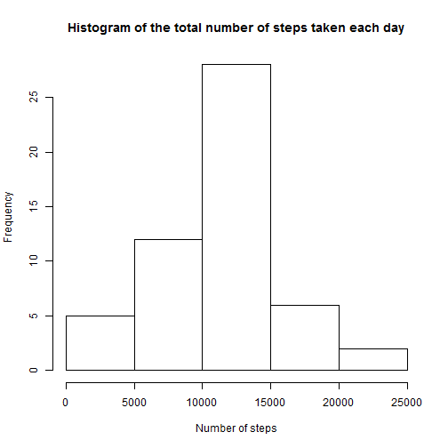
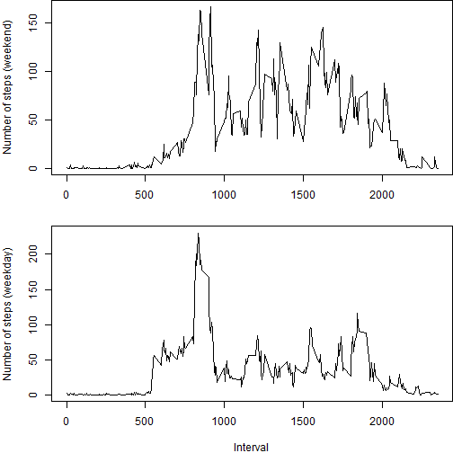

# Reproducible Research: Peer Assessment 1


## Loading and preprocessing the data

```r
Sys.setlocale("LC_TIME", "English")
```

```
## [1] "English_United States.1252"
```

```r
data <- read.csv("activity.csv")
```


## What is mean total number of steps taken per day?

```r
aggr <- aggregate(data$steps, by = list(data$date), FUN = sum)
hist(aggr$x, xlab = "Number of steps")
```

 

```r
mean(aggr$x, na.rm = TRUE)
```

```
## [1] 10766
```

```r
median(aggr$x, na.rm = TRUE)
```

```
## [1] 10765
```


## What is the average daily activity pattern?

```r
aggr2 <- aggregate(data$steps, by = list(data$interval), FUN = mean, na.rm = T)
plot(aggr2$Group.1, aggr2$x, type = "l", xlab = "Interval", ylab = "Average number of steps")
```

 

```r

aggr2[aggr2$x == max(aggr2$x), "Group.1"]
```

```
## [1] 835
```


## Imputing missing values

```r
ok <- complete.cases(data)
sum(!ok)
```

```
## [1] 2304
```

```r

new <- merge(data, aggr2, by.x = "interval", by.y = "Group.1")
new[is.na(new$steps), "steps"] = new[is.na(new$steps), "x"]
new <- new[, c("steps", "date", "interval")]

aggr3 <- aggregate(new$steps, by = list(new$date), FUN = sum)
hist(aggr3$x, xlab = "Number of steps")
```

 

```r
mean(aggr3$x, na.rm = TRUE)
```

```
## [1] 10766
```

```r
median(aggr3$x, na.rm = TRUE)
```

```
## [1] 10766
```


## Are there differences in activity patterns between weekdays and weekends?

```r
new$date = strptime(new$date, format = "%Y-%m-%d")
new$weekday = "weekday"
filter = weekdays(new$date) %in% c("Saturday", "Sunday")
new[filter, "weekday"] = "weekend"
new$weekday = factor(new$weekday)

aggr4 <- aggregate(new$steps, new[, c("weekday", "interval")], FUN = mean)
par(mfcol = c(2, 1), mar = c(4, 4, 0, 0))
plot(aggr4[filter, "interval"], aggr4[filter, "x"], type = "l", xlab = "", ylab = "Number of steps")
plot(aggr4[!filter, "interval"], aggr4[!filter, "x"], type = "l", xlab = "Interval", 
    ylab = "Number of steps")
```

 

